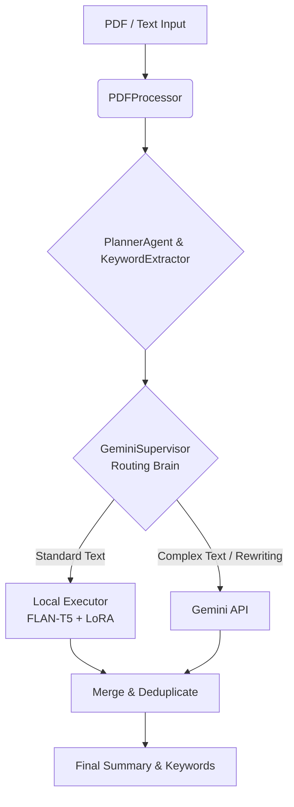

<div align="center">
  <h1>🧠 Smart Notes Summarizer</h1>
  <p><b>Agentic AI for intelligent document processing and summarization.</b></p>
</div>

<br>

<div align="center">
  
  
  
  
  
  
</div>

<br>

An agentic multi-agent system that dynamically routes summarization tasks between a locally fine-tuned **FLAN-T5** model and the **Gemini API** based on text complexity. Ingests unstructured PDFs, generates semantic summaries, and extracts keywords using multi-algorithmic NLP.

## 🚀 Tech Stack

- **Core AI:** Transformers, PEFT (LoRA), PyTorch, Google Generative AI
- **Frontend UI:** Streamlit
- **NLP Pipeline:** spaCy, NLTK, YAKE, RAKE
- **Data Ingestion:** PyMuPDF (fitz), pdf2image, pytesseract

## 🌟 Key Features

- **🤖 Agentic Multi-Agent Workflow**: Gemini Supervisor dynamically routes tasks between local FLAN-T5 and external Gemini API based on text complexity analysis.
- **📄 Automated Document Pipeline**: Ingests, parses, and structures unstructured PDFs into semantic summaries (PyMuPDF + OCR fallback).
- **🪟 Sliding-Window Chunking**: Optimizes context window performance by compressing payload sizes while eliminating data loss for long documents.
- **🏷️ Multi-Algorithmic Keyword Extraction**: Combines YAKE, RAKE, and TF-IDF with spaCy NLP for robust keyword identification.
- **⚡ PEFT Fine-Tuning**: LoRA adapters for parameter-efficient fine-tuning of FLAN-T5 on summarization tasks.

## 🏗️ Architecture



## 📁 Project Structure

```
smart-notes-summarizer/
├── agent/
│   ├── agent.py              # Main orchestrator
│   ├── brain.py              # Gemini Supervisor (routing brain)
│   ├── planner.py            # Text complexity analyzer
│   ├── executor.py           # FLAN-T5 + LoRA with sliding-window chunking
│   ├── pdf_processor.py      # PDF ingestion (PyMuPDF + OCR)
│   └── keyword_extractor.py  # Multi-algorithmic extraction
├── finetuning/
│   └── train_lora.py         # LoRA fine-tuning script
├── models/
│   └── lora_weights/         # Pre-trained LoRA adapter weights
├── tests/
│   └── test_summarization.py # Test suite
├── streamlit_app.py          # Streamlit Web UI (Primary Interface)
├── main.py                   # CLI entry point
├── requirements.txt
└── README.md
```

## QUICK START

### INSTALLATION

```bash
pip install -r requirements.txt
python -m spacy download en_core_web_sm
```

### SET UP GEMINI API (optional — falls back to local model)

```bash
export GEMINI_API_KEY="your-api-key"
```

### USAGE

#### 1. Web UI (Recommended)
```bash
streamlit run streamlit_app.py
```
*Opens a premium dark-themed web interface at `http://localhost:8501` where you can paste text or upload PDFs.*

#### 2. COMMAND LINE
```bash
# Summarize a PDF
python main.py --pdf path/to/document.pdf

# Summarize text directly
python main.py --text "Your text here..."

# Control summary length
python main.py --pdf notes.pdf --length short   # short | normal | long
```

### RUN TESTS

```bash
pytest tests/ -v
```

## HOW IT WORKS

1. **Ingestion**: `PDFProcessor` extracts text from unstructured PDFs (with OCR fallback for scanned documents)
2. **Cleaning**: Aggressive regex strips Wikipedia-style citations (`[1]`, `[citation needed]`), fixes hyphenation, and removes duplicate spaces.
3. **Chunking**: For long texts, a sliding-window strategy splits text into overlapping 2000-char chunks.
4. **Analysis & Routing**: `GeminiSupervisor` analyzes each chunk and decides the processing strategy:
   - `summarize_local` → Route to FLAN-T5 + LoRA
   - `summarize_gemini` → Route to Gemini API
5. **Keywords**: Multi-algorithmic extraction runs across chunks combining YAKE, RAKE, and TF-IDF.
6. **Merging & Final Compression**: Chunk summaries are stitched together, and routed back through the pipeline for a final, comprehensive double-summarization pass to ensure a cohesive final output.

## FINE-TUNING

To fine-tune FLAN-T5 with LoRA on your own dataset:

```bash
python finetuning/train_lora.py \
  --dataset_path ./data/my_dataset \
  --model_name google/flan-t5-small \
  --epochs 3 \
  --lora_r 16 \
  --lora_alpha 32
```
